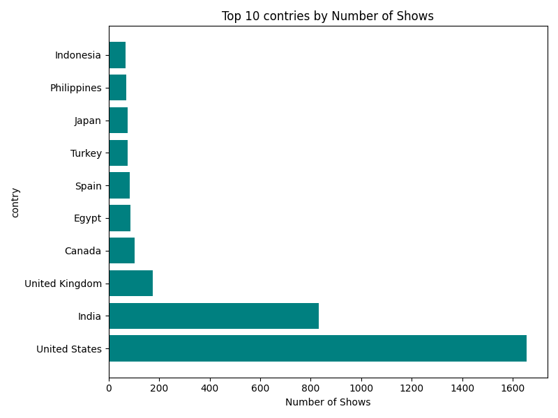
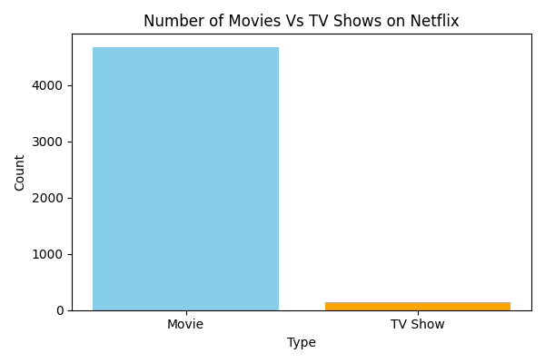
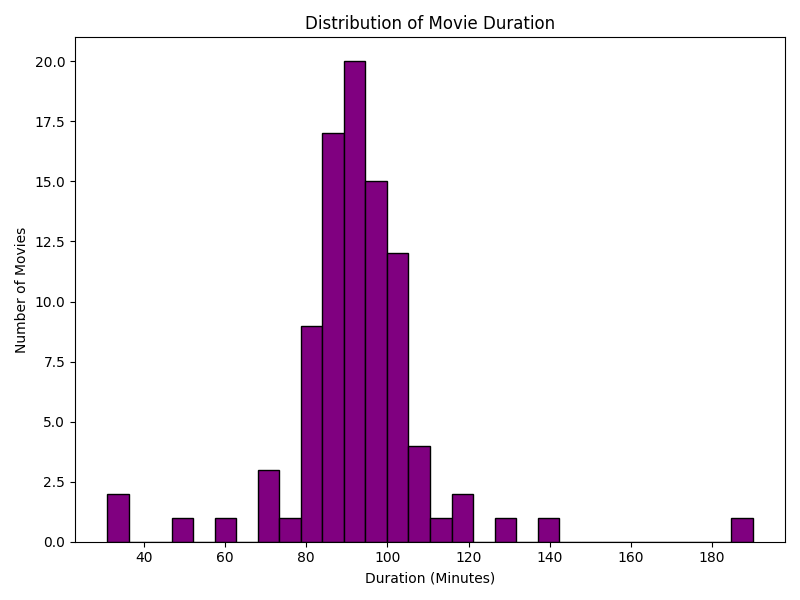
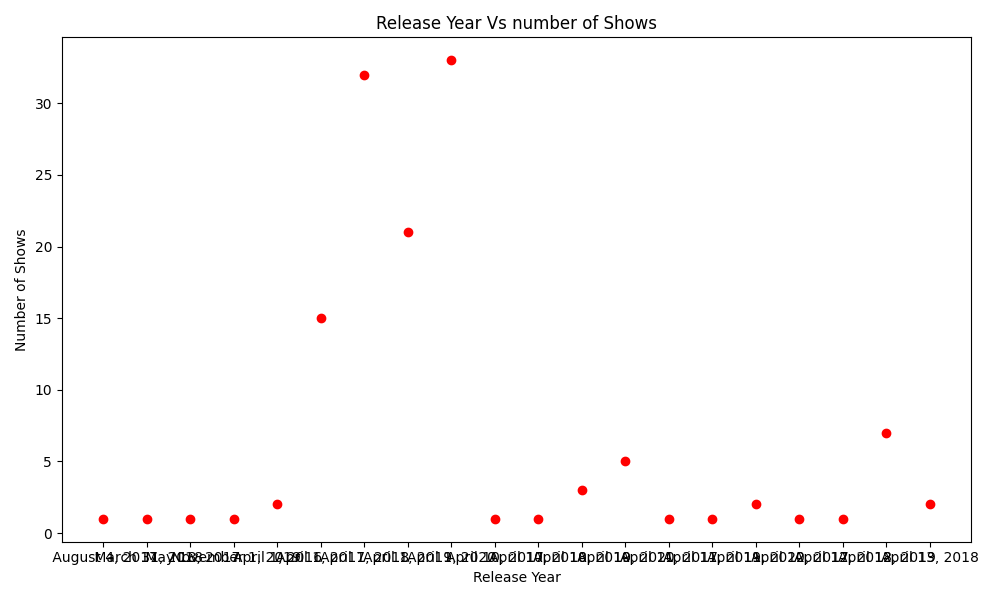
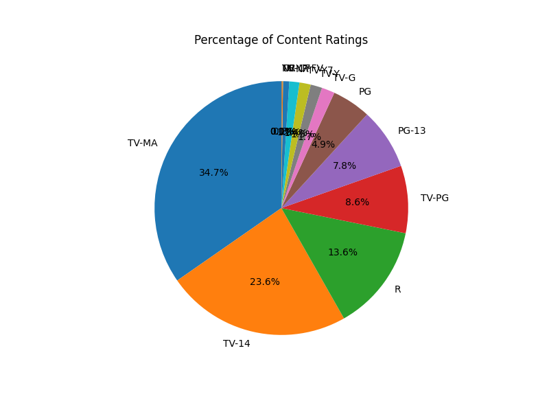
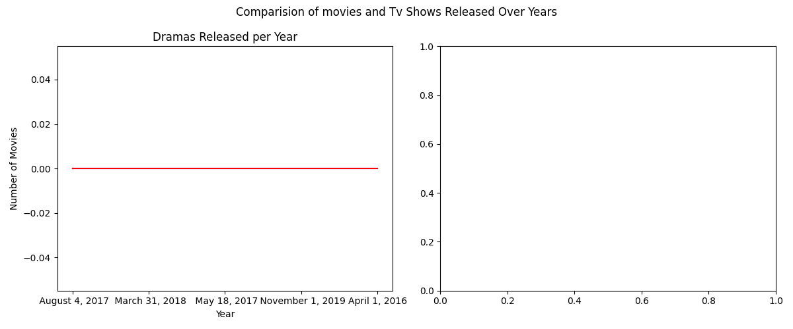

# NetflixInsights-Matplotlib

# 🎬 Netflix Data Visualization

This project explores and visualizes a Netflix-style dataset using Python's Matplotlib and Pandas libraries. It includes bar charts, pie charts, histograms, scatter plots, and line plots to uncover insights about content types, ratings, durations, release trends, and country-wise distributions.

---

## 📁 Dataset

The dataset contains details like:
- Title, Category, Type (Film/TV Show)
- Cast, Country, Release Date
- Rating, Duration, Description

---

## 📊 Visualizations Included

1. **Bar Chart** – Number of Movies vs TV Shows
2. **Pie Chart** – Percentage of Content Ratings
3. **Histogram** – Distribution of Movie Durations
4. **Scatter Plot** – Release Year vs Number of Shows
5. **Horizontal Bar Chart** – Top 10 Countries by Number of Shows
6. **Line Plot** – Year-wise comparison of Comedies and Dramas

---

## 🛠️ Tools Used

- Python 🐍
- Pandas 📊
- Matplotlib 🎨

---

## 📌 How to Run

```
bash
pip install pandas matplotlib
python NetFlixProjectMatplotlib.py
```
## 📊 Sample Visualizations

### 🌍 Top 10 Countries by Content


### 🎬 Movies vs TV Shows Comparison


### ⏱️ Movie Duration Histogram


### 📅 Release Year Scatter Plot


### 📈 Content Rating Distribution


### 🔄 Movies & TV Shows Distribution

